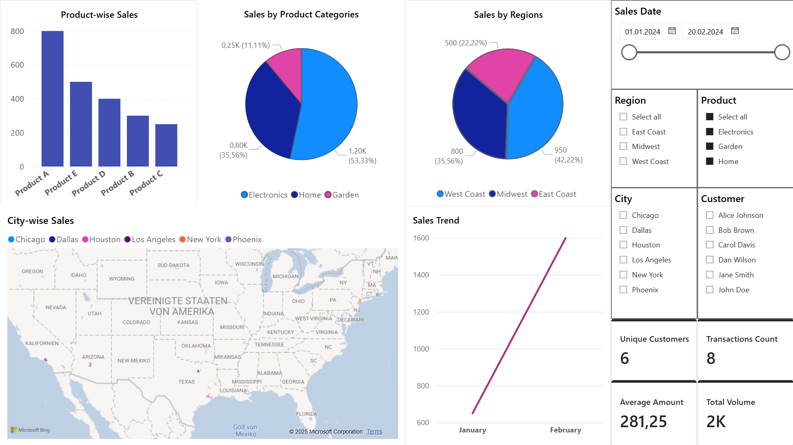

# Sales Insight Dashboard

## Project Description

This project is an interactive Power BI report designed to analyze sales data from multiple perspectives — products, categories, customers, and geography. It features interactive dashboards and key metrics that provide valuable insights into sales performance and trends over time.

## Report Description

### 1. Key Performance Indicators (KPIs)  
- **Unique Customers:** Total number of unique customers in the selected dataset.  
- **Transaction Count:** Total number of sales transactions.  
- **Average Amount:** Average value of a single transaction.  
- **Total Volume:** Total sales volume, expressed in thousands.

### 2. Dashboards and Visualizations  

#### Product-wise Sales  
- **Type:** Vertical bar chart  
- **Description:** Shows sales volume for each specific product (e.g., Product A, Product D, Product E).  
- **Purpose:** Quickly identify top-selling and low-performing products.

#### Sales by Product Categories  
- **Type:** Donut chart  
- **Description:** Displays the sales share of each product category (e.g., Electronics, Home, Garden) with absolute values and percentages.  
- **Purpose:** Visualize which categories generate the most revenue.

#### Sales by Regions  
- **Type:** Donut chart  
- **Description:** Shows sales distribution across three regions (West Coast, Midwest, East Coast) with absolute values and percentages.  
- **Purpose:** Understand which regions are most successful and where attention is needed.

#### City-wise Sales  
- **Type:** Interactive map (USA)  
- **Description:** Displays cities where sales occurred, with points colored based on filters or categories.  
- **Purpose:** Visualize geographic sales distribution and highlight key markets.

#### Sales Trend  
- **Type:** Line chart  
- **Description:** Shows sales dynamics over the selected period (e.g., January to February).  
- **Purpose:** Track overall sales trends — growth, decline, or stability.

### 3. Filter Panel (right side of the dashboard)  
- **Sales Date:** Select date range for analysis.  
- **Region:** Filter by one or multiple regions.  
- **Product:** Filter by specific products.  
- **City:** Filter by cities.  
- **Customer:** Filter by specific customers.

### 4. Additional Features  
- Date range selection for flexible data viewing.  
- Interactive visualizations that update with filter changes for detailed analysis.

### 5. Calculated Fields (Measures)  
- **Total Sales Volume:** Sum of sales.  
- **Transaction Count:** Number of transactions.  
- **Average Transaction Amount:** Average sale amount.  
- **Unique Customers:** Count of unique customers.  
- **Sales by Region:** Sales summed by region.

### 6. Table Relationships  
- `sales.product_id` → `products.product_id`  
- `products.category_id` → `categories.category_id`  
- `sales.customer_id` → `customers.customer_id`  
- `customers.region_id` → `regions.region_id`  
- `sales.region_id` → `regions.region_id`

---

## Goal  
Create an interactive Power BI report to analyze sales data by products, product categories, customers, cities, and regions, as well as to track sales trends and evaluate the performance of different categories and regions.
The use of filters and dynamic visualizations enables in-depth data exploration, making this tool useful for sales analysts, managers, and decision-makers.

